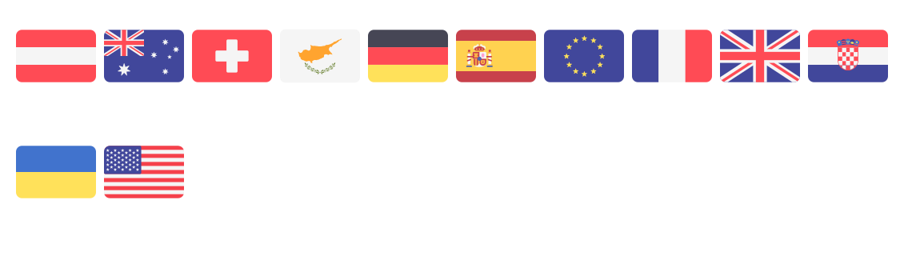

<h1 align="center" id="title">FlagSVG</h1>


<p align="center">
    
    
</p>

FlagSVG is a repository of country flags in SVG format. Hosted on GitHub, it provides a straightforward way to access flag icons for use in your projects. Simply reference the flag you need from our collection with a direct URL.

## 🛠️ Features

- **Comprehensive Flag List**: Browse and access a variety of country flags in SVG format.
- **Easy Integration**: Use simple URLs to include flags in your web projects.
- **Open Access**: Free to use and available through GitHub.

## 📖 Usage

To use FlagSVG, you can directly embed flag SVGs into your project. Here’s how you can get a specific flag:

1. **Identify the Flag Code**: Find the code for the flag you need (e.g., `US` for the United States).
2. **Embed the SVG**: Use the URL pattern to get the flag SVG.

   ```html
   .svg" alt="Country Flag">
   ```

   Replace `<flag code>` with the appropriate code for the flag you want.

## 🎌 Available Flags

<picture>
    <source media="(prefers-color-scheme: dark)"  srcset="./output/flagPreviewDark.png" />
    <source media="(prefers-color-scheme: light)" srcset="./output/flagPreviewLight.png" />
    
</picture>

## 📜 License

This project is licensed under the [CC0-1.0 License](https://creativecommons.org/publicdomain/zero/1.0/).

## ✍️ Authors

- [@thedannicraft](https://www.github.com/thedannicraft)
